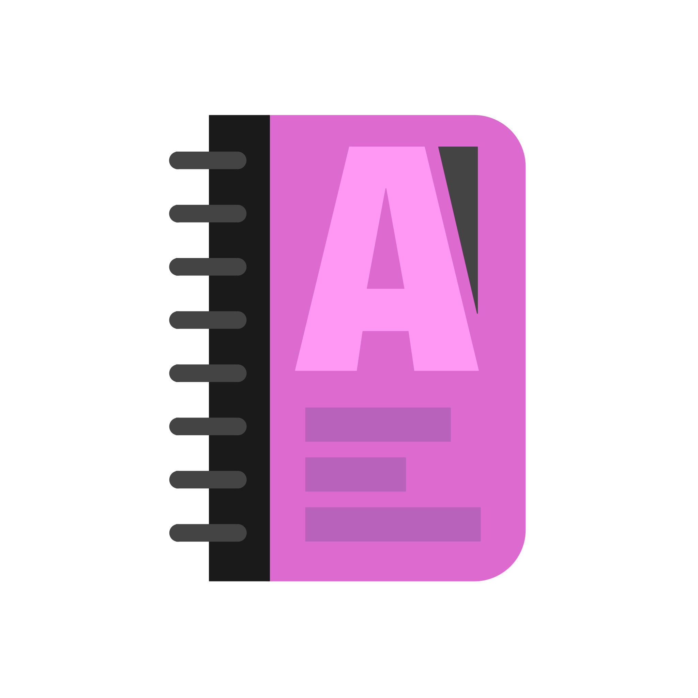

<div align="center">
    <a href="https://genda.dera.page/">
        
    </a>
    <h1 align="center">Genda (web-app)</h1>
    <p align="center">
        Genda is a free website allowing students to view their course schedule at Rouen's engineering school.<br/>
        <a href="https://genda.dera.page/"><b>Explore our website »</b></a><br/><br/>
    </p>
</div>

## 🌱 Getting Started

### 🤝 Joining the Project

We’d love to have you on board! 💜
To get started, please reach out to us on [our Discord server](https://discord.gg/TpdbUyfcbJ).

**⚠️ Heads-up**: You’ll need our approval to contribute since access to the backend server (not open-source) is required. Once you’re in, we’ll be thrilled to guide you!

### 🛠 Install the Tools

Make sure you have the following installed on your machine:
- [Rust](https://www.rust-lang.org/)
- [SQLite3](https://www.sqlite.org/index.html)
- [Trunk](https://trunkrs.dev/)
- [Diesel CLI](https://diesel.rs/guides/getting-started)

For Ubuntu-based systems, run:

```bash
# Rust
curl --proto '=https' --tlsv1.2 -sSf https://sh.rustup.rs | sudo sh 

# Wasm target
rustup target add wasm32-unknown-unknown

# SQLite3
sudo apt install sqlite3

# Trunk
cargo install trunk

# Diesel CLI
cargo install diesel_cli --no-default-features --features "sqlite-bundled"
```

### 📂 Code Organization

This repository contains the 3 open-source components of Genda:
- Frontend files → `/static`
- Shared data structures → `/common`
- Web application → `/app`

The backend is closed-source, but you’ll get access if you need to 😉.

**Required file structure:**

```text
genda/
├─ web-api/
└─ web-app
```

**Setup commands:**

```bash
mkdir genda && cd genda
git clone https://github.com/INSAgenda/frontend
git clone https://github.com/INSAgenda/web-app
```

### ⚙️ Database Initialization

We use [Diesel](https://diesel.rs/) as our ORM. To set up the database, run:

```bash
# Create an empty database
cd web-api
diesel setup --database-url=./database
cd ..
```

This creates a fresh SQLite database and ensures all required tables are ready to use. 🎉

In the future, you may need to create and run migrations with:

```bash
cd web-api
diesel migration generate <future_migration_name>
diesel migration run --database-url=./database
cd ..
```

### Run the code

```bash
# Start the backend in the background (use `fg` to bring it back to the foreground)
cd web-api
cargo run --features=fetching &
cd ..

# Build the web-app
cd web-app/app
trunk build --public-url=agenda
cd ../..
```

The web app will be served at:
👉 http://localhost:8088/agenda 🎉

💡 You can also run `trunk watch` to rebuild automatically whenever you update source files.

## 🙌 Contributing

Your input matters! Whether it’s fixing bugs, improving endpoints, or keeping things stable, every contribution helps ensure our system runs at its best.

## 💬 Need Help?

We’ve got you covered! If you ever feel stuck, join our community on Discord:
👉 [Join the Discord](https://discord.gg/TpdbUyfcbJ)

Simon and Dimitri are always around (wherever they are 🌍) and will be delighted to help you contribute and get the most out of this project. Don’t hesitate to reach out!

## License

This project is **unlicensed**.  
The source code is strictly protected and belongs to its contributors.  
🚫 You may **not** use any part of this project without permission.
